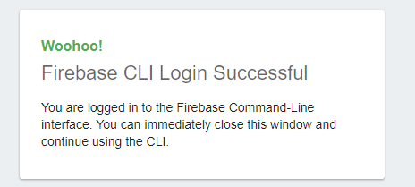
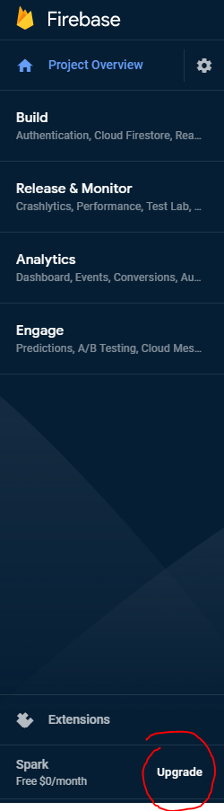
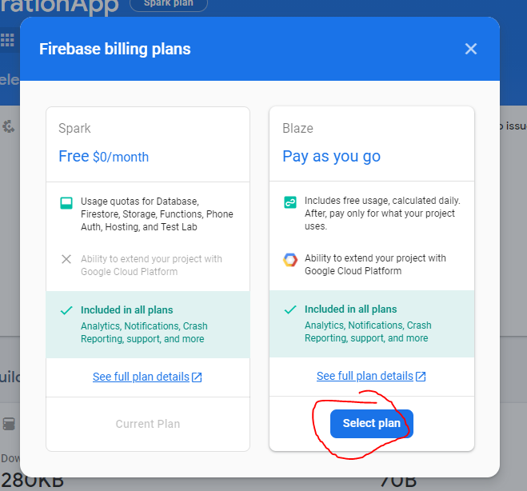

# Tration-Backend
Backend for Tration Application

This is now a API repo for Tration application

# Dev Set Up
`git pull https://github.com/Quick-Silver-Stash/Tration-Backend.git`  
`cd Tration-Backend/functions`  
`npm install`  

# Credentials Set up
`npm install -g firebase-tools`

in the `/functions` directory run

`firebase login`

you will be led to google login, and after you grant access you should see this screen



Then upgrade your billing plan. Don't worry you have 2,000,000 functions calls for free per month before you are charged.




# Dev
go add your function to the directory `functions/{YOUR_API_DIR}/{YOUR_API}.js`

general function template should start

```js
const functions = require("firebase-functions");
const admin = require("firebase-admin");
const firebase = require("firebase");
admin.initializeApp(functions.config().firebase);
firebase.initializeApp(functions.config().firebase);

exports.function1 = functions.https.onRequest((request, response) => {
    ...
});
```

Then, add your function to index.js

```js
const function1 = require('./{YOUR_API_DIR}/function1');

exports.function1 = function1.function1;
```

# Deploy
`firebase deploy`

will automatically deploy the function to firebase cloud. You can check the function deployed at:

https://console.firebase.google.com/u/1/project/trationapp/functions/list

# Reference
There are more reference [here](https://firebase.google.com/docs/functions/get-started)
Also, you can reference [here](https://firebase.google.com/docs/functions/organize-functions) for alternative organization of functions.